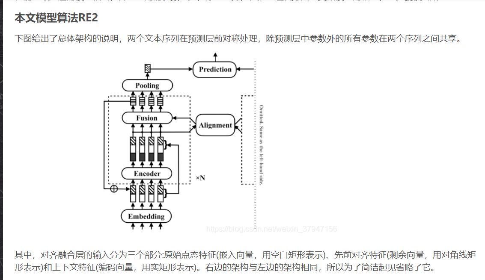
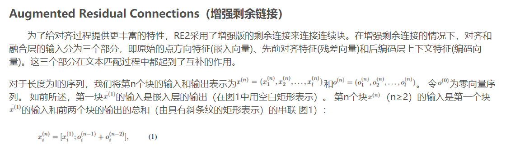
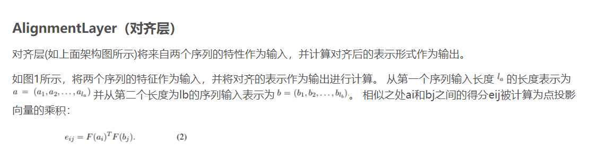

##前言
RE2，简称 `"Simple and Effective Text Matching with Richer Alignment Features"`.

 文中提出了一种快速、强悍神经网络方法来用于通用文本的匹配。
我们研究了构建一个快速且性能良好的文本匹配模型的足够条件，
并建议保持三个用于序列间对齐的关键特性:原始点对齐特性、先前对齐特性和上下文特性，
同时简化所有剩余组件。我们在自然语言推理、意图识别和答案选择等任务中，
对4个研究良好的基准数据集进行了实验。我们的模型性能与最先进的模型相当，
并且使用的参数更少，除此之外，在推理速度方面与类似模型的相比，至少要快6倍。


##1.模型整体结构



```python 
def forward(self, inputs):
    a = inputs['text1']
    b = inputs['text2']
    mask_a = inputs['mask1']
    mask_b = inputs['mask2']

    a = self.embedding(a)
    b = self.embedding(b)
    res_a, res_b = a, b

    for i, block in enumerate(self.blocks):
        if i > 0:
            a = self.connection(a, res_a, i)
            b = self.connection(b, res_b, i)
            res_a, res_b = a, b
        a_enc = block['encoder'](a, mask_a)
        b_enc = block['encoder'](b, mask_b)
        a = torch.cat([a, a_enc], dim=-1)
        b = torch.cat([b, b_enc], dim=-1)
        align_a, align_b = block['alignment'](a, b, mask_a, mask_b)
        a = block['fusion'](a, align_a)
        b = block['fusion'](b, align_b)
    a = self.pooling(a, mask_a)
    b = self.pooling(b, mask_b)
    return self.prediction(a, b)
```

##2.编码层(Encoder)

```python
class Encoder(nn.Module):
    def __init__(self, args, input_size):
        super().__init__()
        self.dropout = args.dropout
        self.encoders = nn.ModuleList([Conv1d(
                in_channels=input_size if i == 0 else args.hidden_size,
                out_channels=args.hidden_size,
                kernel_sizes=args.kernel_sizes) for i in range(args.enc_layers)])

    def forward(self, x, mask):
        x = x.transpose(1, 2)  # B x C x L
        mask = mask.transpose(1, 2)
        for i, encoder in enumerate(self.encoders):
            x.masked_fill_(~mask, 0.)
            if i > 0:
                x = f.dropout(x, self.dropout, self.training)
            x = encoder(x)
        x = f.dropout(x, self.dropout, self.training)
        return x.transpose(1, 2)  # B x L x C
```

##3.增强残差连接(Augmented Residual Connections)



```python
class AugmentedResidual(nn.Module):
    def forward(self, x, res, i):
        if i == 1:
            return torch.cat([x, res], dim=-1)  # res is embedding
        hidden_size = x.size(-1)
        x = (res[:, :, :hidden_size] + x) * math.sqrt(0.5)
        return torch.cat([x, res[:, :, hidden_size:]], dim=-1)  # latter half of res is embedding

```

##4.对齐层(Alignment Layer)



```python
class Alignment(Module):
    def __init__(self, args, __):
        super().__init__()
        self.temperature = nn.Parameter(torch.tensor(1 / math.sqrt(args.hidden_size)))

    def _attention(self, a, b):
        return torch.matmul(a, b.transpose(1, 2)) * self.temperature

    def forward(self, a, b, mask_a, mask_b):
        attn = self._attention(a, b)
        mask = torch.matmul(mask_a.float(), mask_b.transpose(1, 2).float()).byte()
        attn.masked_fill_(~mask, -1e7)
        attn_a = f.softmax(attn, dim=1)
        attn_b = f.softmax(attn, dim=2)
        feature_b = torch.matmul(attn_a.transpose(1, 2), a)
        feature_a = torch.matmul(attn_b, b)
        self.add_summary('temperature', self.temperature)
        self.add_summary('attention_a', attn_a)
        self.add_summary('attention_b', attn_b)
        return feature_a, feature_b
```

#5.融合层(Fusion Layer)


```python
@register('simple')
class Fusion(nn.Module):
    def __init__(self, args, input_size):
        super().__init__()
        self.fusion = Linear(input_size * 2, args.hidden_size, activations=True)

    def forward(self, x, align):
        return self.fusion(torch.cat([x, align], dim=-1))


@register('full')
class FullFusion(nn.Module):
    def __init__(self, args, input_size):
        super().__init__()
        self.dropout = args.dropout
        self.fusion1 = Linear(input_size * 2, args.hidden_size, activations=True)
        self.fusion2 = Linear(input_size * 2, args.hidden_size, activations=True)
        self.fusion3 = Linear(input_size * 2, args.hidden_size, activations=True)
        self.fusion = Linear(args.hidden_size * 3, args.hidden_size, activations=True)

    def forward(self, x, align):
        x1 = self.fusion1(torch.cat([x, align], dim=-1))
        x2 = self.fusion2(torch.cat([x, x - align], dim=-1))
        x3 = self.fusion3(torch.cat([x, x * align], dim=-1))
        x = torch.cat([x1, x2, x3], dim=-1)
        x = f.dropout(x, self.dropout, self.training)
        return self.fusion(x)

```

#6.池化层(Pooling Layer)

```python
class Pooling(nn.Module):
    def forward(self, x, mask):
        return x.masked_fill_(~mask, -float('inf')).max(dim=1)[0]
```

#7.预测层(Prediction Layer)


```python
@register('simple')
class Prediction(nn.Module):
    def __init__(self, args, inp_features=2):
        super().__init__()
        self.dense = nn.Sequential(
            nn.Dropout(args.dropout),
            Linear(args.hidden_size * inp_features, args.hidden_size, activations=True),
            nn.Dropout(args.dropout),
            Linear(args.hidden_size, args.num_classes),
        )

    def forward(self, a, b):
        return self.dense(torch.cat([a, b], dim=-1))


@register('full')
class AdvancedPrediction(Prediction):
    def __init__(self, args):
        super().__init__(args, inp_features=4)

    def forward(self, a, b):
        return self.dense(torch.cat([a, b, a - b, a * b], dim=-1))


@register('symmetric')
class SymmetricPrediction(AdvancedPrediction):
    def forward(self, a, b):
        return self.dense(torch.cat([a, b, (a - b).abs(), a * b], dim=-1))
```