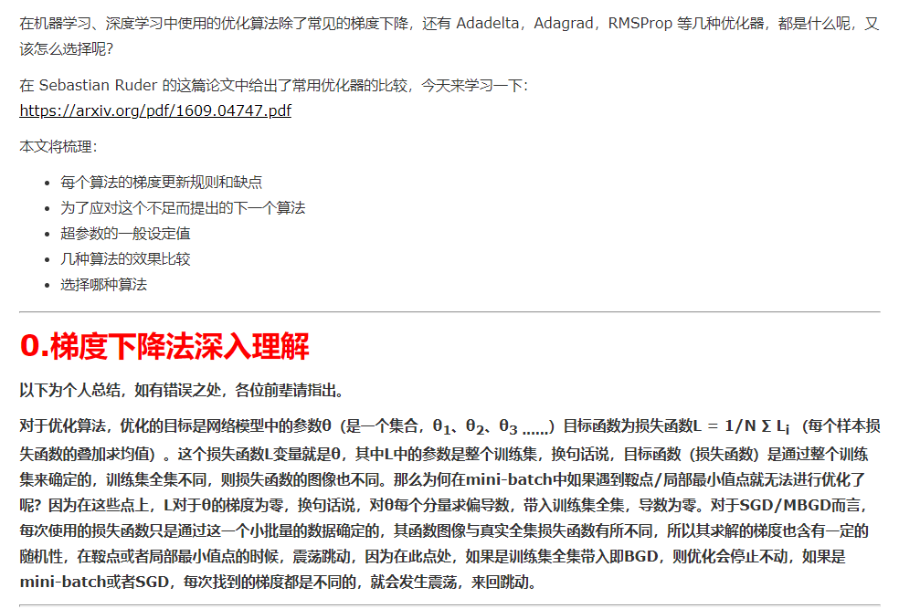
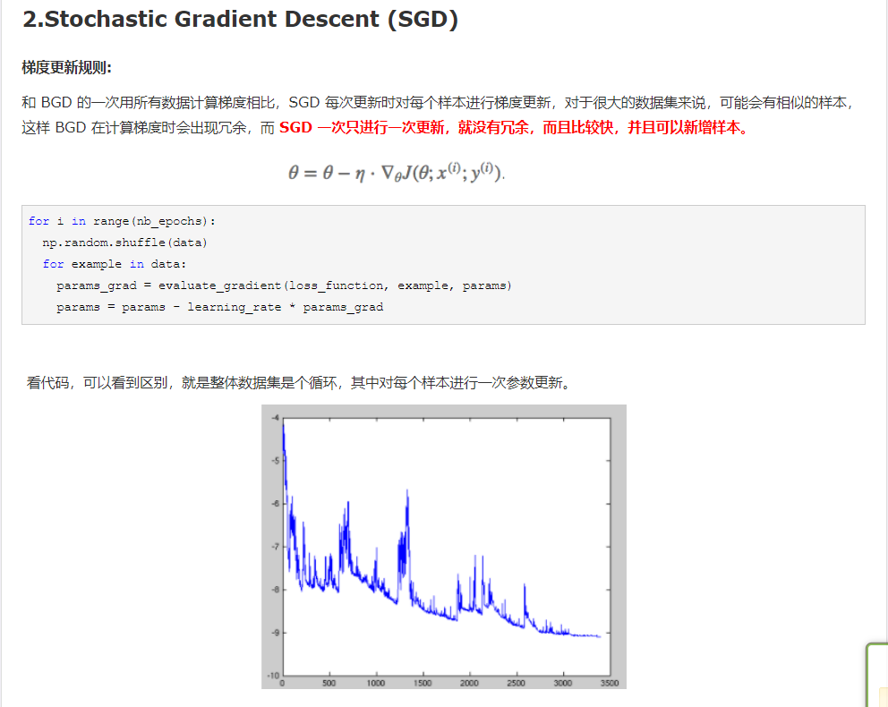
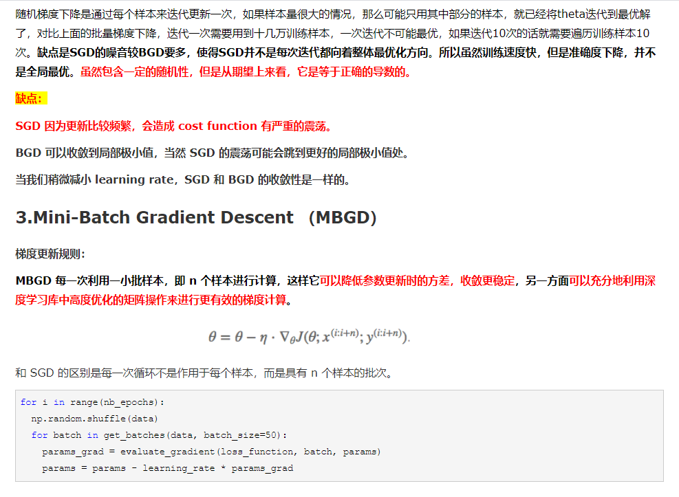
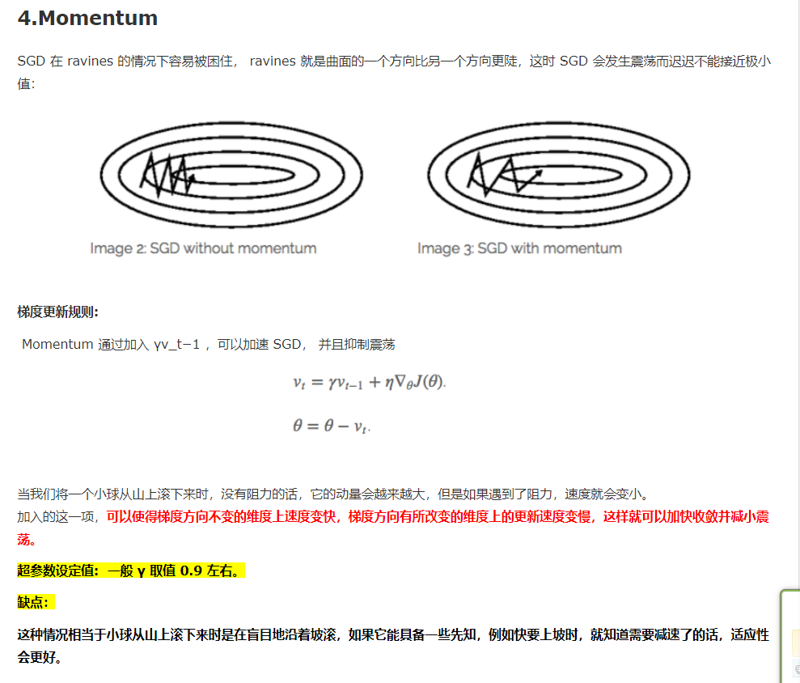
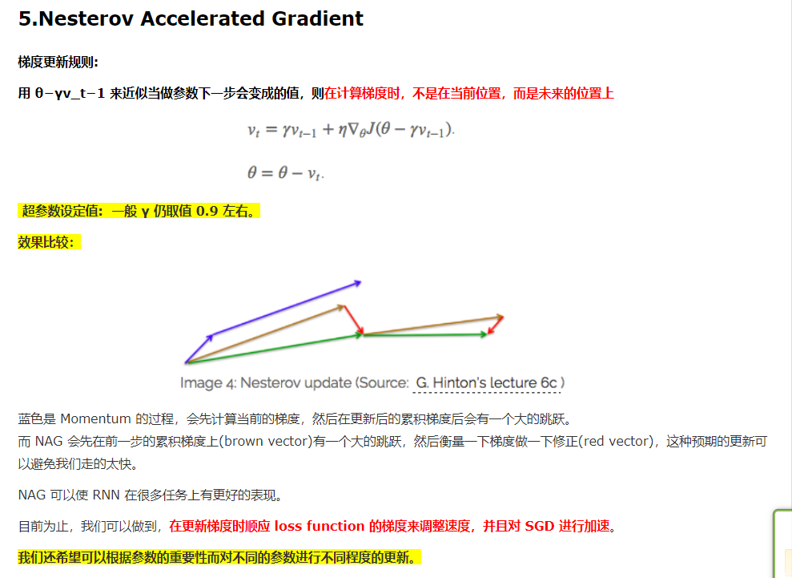
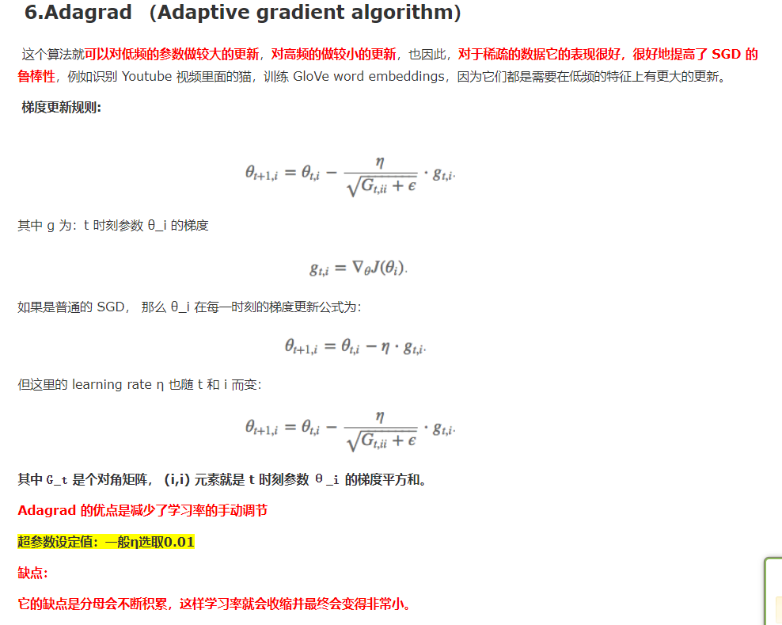
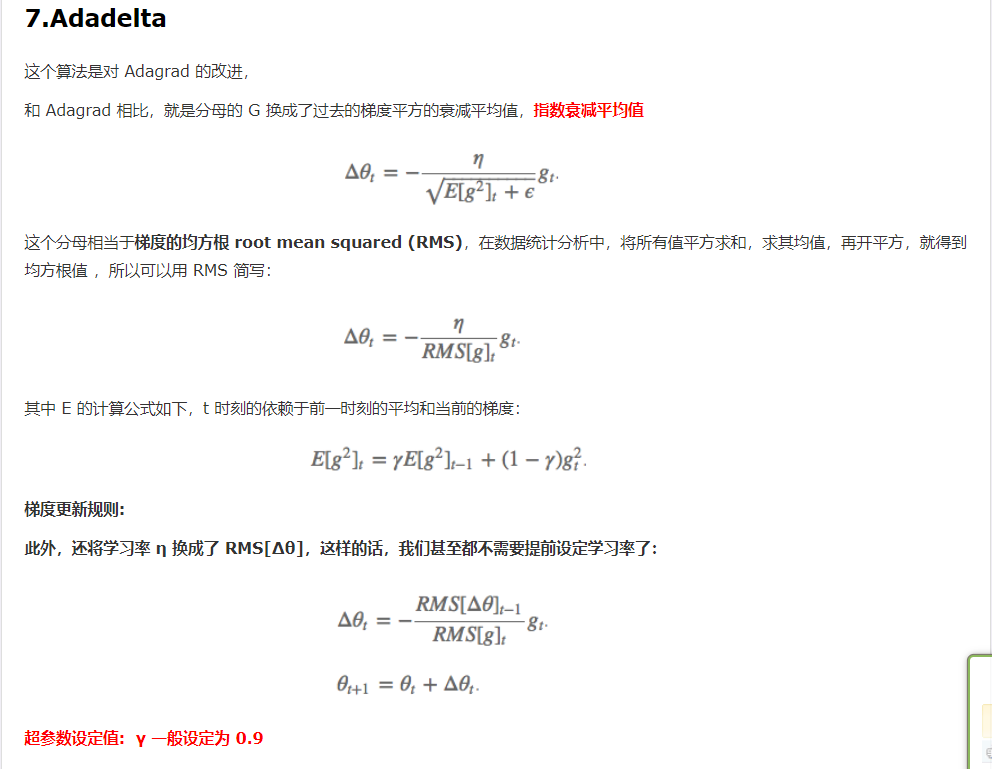
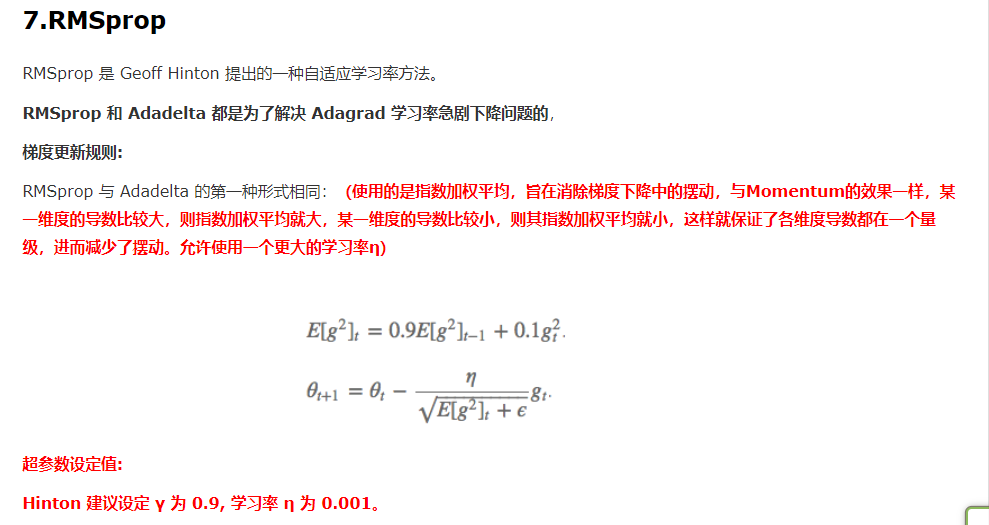
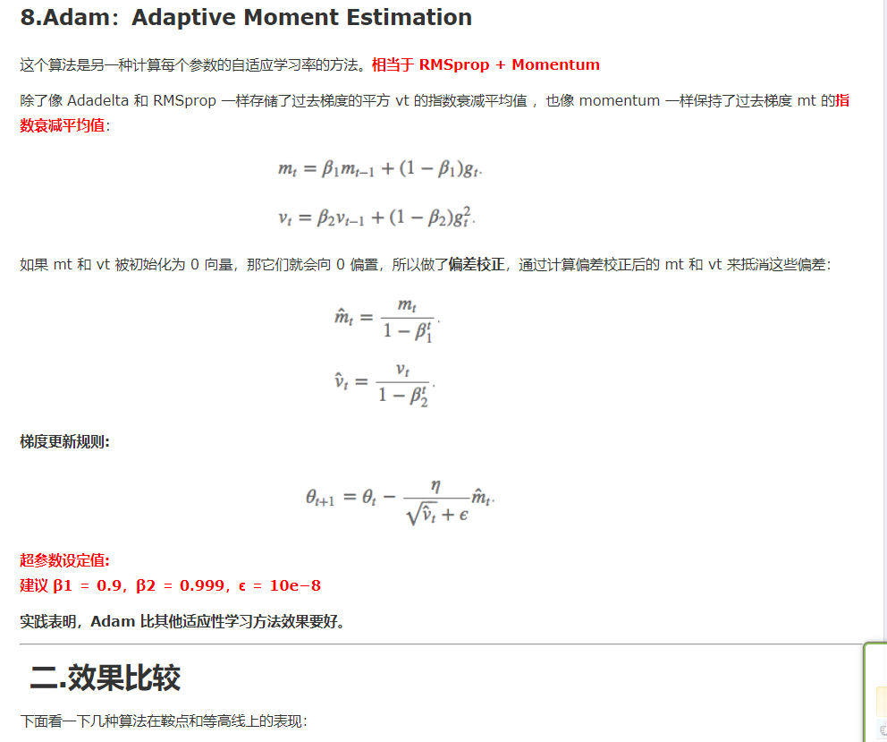
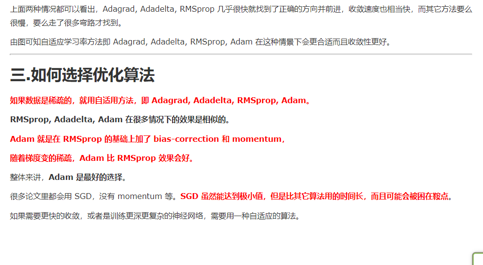

---
layout:     post
title:      Optimizer
subtitle:   BY Blog 添加 Gitalk 的评论插件了
date:       2020-08-24
author:     BY
header-img: img/post-bg-universe.jpg
catalog: true
tags:
    - Blog
---

### 优化器算法Optimizer详解(BGD、SGD、MBGD、Momentum、NAG、Adagrad、Adadelta、RMSprop、Adam)

 

